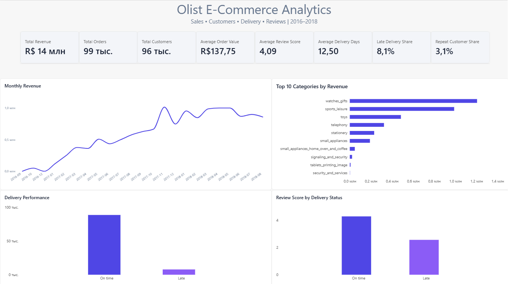

# Olist E-Commerce Analytics

### BI-анализ продаж, клиентов, доставки и отзывов

Проект по анализу бразильского e-commerce на основе публичного Brazilian E-Commerce Public Dataset by Olist.

Цель проекта — исследовать ключевые показатели бизнеса, выявить особенности продаж и клиентского поведения, а также проанализировать качество доставки и его связь с оценками покупателей.

---

## Dashboard



---

## Key Results

| Metric | Result |
|---|---:|
| Revenue | R$ 13.59M |
| Orders | 99K |
| Customers | 96K |
| Average Order Value | R$ 137.75 |
| Average Review Score | 4.09 |
| Average Delivery Time | 12.5 days |
| Late Delivery Share | 8.1% |
| Repeat Customer Share | 3.1% |

---

## Project Overview

В рамках проекта выполнен анализ основных направлений e-commerce бизнеса:

- продажи и выручка;
- динамика продаж по месяцам;
- товарные категории;
- клиенты и повторные покупки;
- сроки и своевременность доставки;
- оценки покупателей;
- взаимосвязь доставки и клиентских оценок.

Результаты анализа представлены в интерактивном Power BI-дашборде.

---

## Tools

- **PostgreSQL** — хранение и обработка данных
- **SQL** — аналитические запросы
- **Power Query** — подготовка и преобразование данных
- **Power BI** — аналитическая модель и визуализация
- **DAX** — расчёт бизнес-метрик

---

## Dataset

В проекте использован **Brazilian E-Commerce Public Dataset by Olist**.

Датасет содержит информацию о заказах, товарах, клиентах, продавцах, доставке и отзывах.

Для основного анализа использовались таблицы:

- `olist_orders_dataset`
- `olist_order_items_dataset`
- `olist_products_dataset`
- `olist_customers_dataset`
- `olist_order_reviews_dataset`
- `product_category_name_translation`

---

## Data Model

Основная модель построена вокруг таблицы заказов.

Ключевые связи:

- Orders → Order Items
- Orders → Customers
- Orders → Reviews
- Products → Order Items
- Product Categories → Products
- Calendar → Orders

Для анализа временной динамики создана отдельная календарная таблица.

---

## SQL Analysis

SQL-анализ выполнен в PostgreSQL.

Подготовлено **15 аналитических запросов**, включающих:

- расчёт выручки;
- количество заказов;
- средний чек;
- динамику выручки по месяцам;
- анализ товарных категорий;
- повторные покупки;
- среднее время доставки;
- долю опозданий;
- анализ оценок клиентов;
- средний чек по месяцам;
- рост выручки месяц к месяцу;
- агрегатные функции;
- `JOIN`;
- `CTE`;
- оконные функции.

Полный SQL-анализ находится в файле:

`analysis.sql`

---

## Power BI & DAX

В Power BI создана аналитическая модель и интерактивный дашборд.

Основные DAX-меры:

- `Total Revenue`
- `Total Orders`
- `Average Order Value`
- `Total Customers`
- `Repeat Customer Share`
- `Average Review Score`
- `Average Delivery Days`
- `Late Delivery Share`
- `Previous Month Revenue`
- `Revenue MoM Growth`

Power Query использовался для подготовки данных и корректного преобразования типов, включая даты и время.

---

## Dashboard

Дашборд включает:

- KPI по выручке, заказам и клиентам;
- средний чек;
- среднюю оценку;
- среднее время доставки;
- долю опозданий;
- долю повторных клиентов;
- динамику месячной выручки;
- топ-10 товарных категорий по выручке;
- показатели своевременности доставки;
- сравнение оценок клиентов в зависимости от доставки.

---

## Business Insights

### 1. Продажи

За анализируемый период было оформлено около **99 тыс. заказов** на общую сумму около **R$ 13.59 млн**.

Средний чек составил около **R$ 137.75**.

### 2. Динамика выручки

Месячная выручка демонстрирует существенный рост в течение 2017 года и достигает уровня около **R$ 1 млн** в отдельные месяцы начала 2018 года.

### 3. Товарные категории

Выручка распределена между большим количеством категорий, при этом несколько категорий формируют значительную часть продаж.

Среди лидеров по выручке — `watches_gifts`, `sports_leisure` и `toys`.

### 4. Доставка

Среднее время доставки составило **12.5 дня**.

Доля заказов, доставленных позже расчётной даты, составила **8.1%**.

### 5. Доставка и клиентские оценки

Заказы, доставленные вовремя, имеют более высокую среднюю оценку по сравнению с заказами с задержкой.

Это позволяет рассматривать своевременность доставки как один из факторов, связанных с клиентской удовлетворённостью.

### 6. Повторные покупки

Доля клиентов, совершивших более одной покупки, составила около **3.1%**.

Показатель может использоваться для дальнейшего анализа удержания клиентов и повторных покупок.

---

## Project Structure

```text
olist-ecommerce-analytics/
│
├── README.md
├── analysis.sql
├── dashboard.png
├── Olist_Ecommerce_Analytics.pbix
└── .gitattributes
